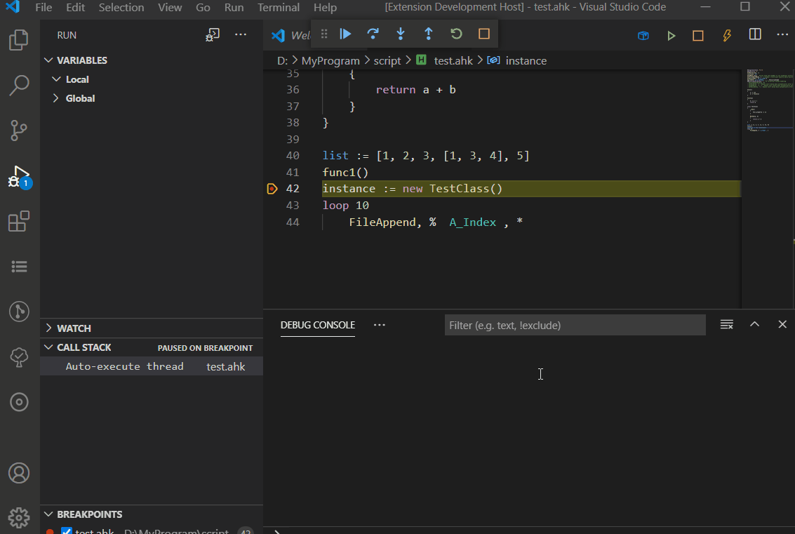
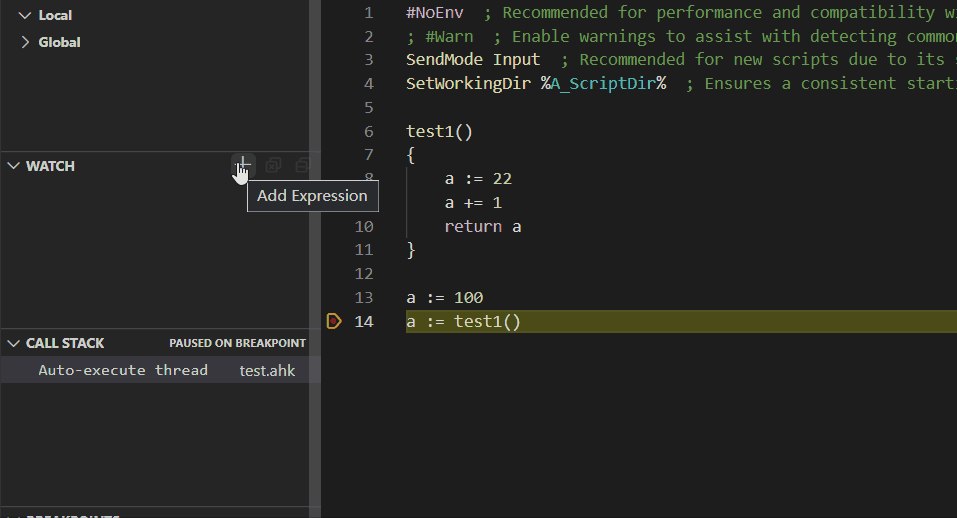
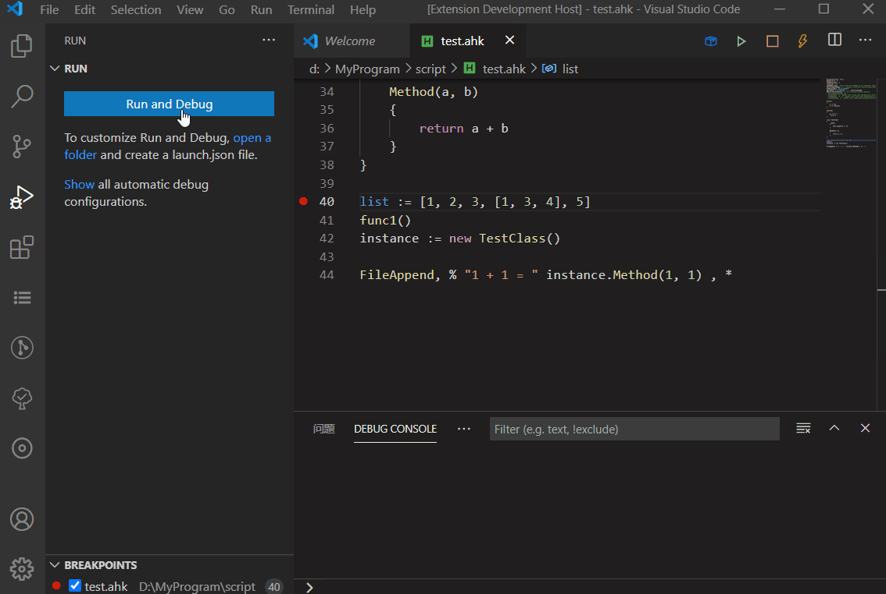

# AutoHotKey Debug

Simple debug adapter for AutoHotKey implemented by AutoHotKey.

## Features

* Basic debug functions. Step into, step out, breakpoints etc.
* Show call stack and varibles.
* change varibles in debugging
* Debug ahkv2 or H version since debug protocol do not change.(by set AhkExecutable path to corresponding runtime path in launch.json)

## Experimental Feature

* Conditional breakpoint
  * Hit Count(how many hits of the breakpoint are ignored)  
  Debug adapter will auto skip breakpoint until script hits breakpoint of a given count.
  
* Watch Expression
  
* Attach Script
  * Support request type `attach` 

## Using

1. Open an AutoHotKey source file.
2. For most simple way, press f5 to debug it.
3. If you want to start at a specific setting. Switch to the debug viewlet.
4. Press the green 'play' button, if vs code doesn't find launch.json, it will creat one for you. Save it and switch back to ahk file you open.
5. Press the green button again, debugger will start.

### Rule of change varibles

* Basically, it is the same grammar with ahk
  * `quoted string`: such as "This is a quoted string."  
     => type "string"
  * `number`: support int, float and hex.   
    eg. `12`,`12.123`, `0xff` => type "integer"(12), "float"(12.123), "integer"(255) 
  * `others`: any other string is treated like that it assign to a varible with `=` in AHKv1.  
    => type "string"

## Supported Settings of Launch.json

* `type`: always ahkdbg.
* `request`: `launch` or `attach`.
* `name`: name of a specific setting.
* `program`: script file to be debugged(by default is file under editing).
* `stopOnEntry`: stop on entry or not.
* `captureStreams`: capture io streams or not.
* `AhkExecutable`: change Default Execute Path. If left blank(use "" as value), the value of the item is automatically filled by the language support extension (by default is automaticlly acquired through registry, usually is  `C:\Program Files\Autohotkey\AutoHotkey.exe`).
* `port`: The port on which to listen for XDebug (default: 9005)

## Known Issues

An early version which needs test. Use it at you own risk.
1. The max number of object children to be display is 99.

## Build

From 0.7.0 version, extension use a compiled version of debug adapter for a better experence. If any changes of DA is needed, the extension must be built again.
1. This project use yarn, so first step is: `yarn install`
2. Set ahk2exe compile option `Base File` to autohotkey v1.36 or above v1 version.
3. `yarn run package`  
or if just compile debug adapter (located in `bin\debugAdapter.exe`).  
   `yarn run precompile`

## Furture Plan

* [ ] Support Evaluate For Hovers
* [x] Support debug console
* [x] Change value of varible in debugging
* [ ] conditional breakpoint (experimental feature, soft implementation)
  * [x] hitCondition
* [x] improve event queue
