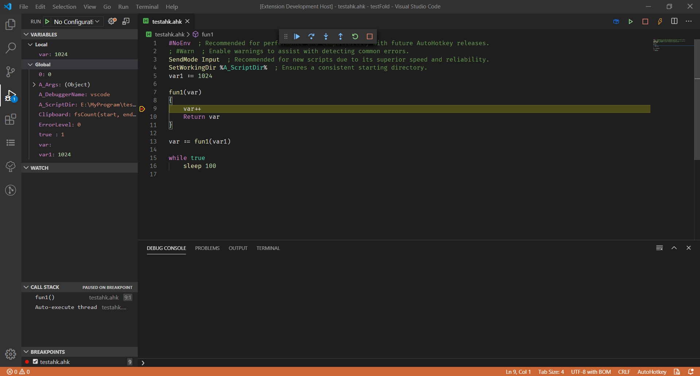

# AutoHotKey Debug

Simple debug adaptor for AutoHotKey.

## Features

* Basic debug functions. Step into, step out, breakpoints etc.
* Show call stack and varibles.

## Using

1. Open an AutoHotKey source file.
2. Switch to the debug viewlet.
3. Press the green 'play' button to start debugging.

## Supported Settings of Launch.json

* `stopOnEntry`: stop on entry or not.
* `captureStreams`: capture io streams or not (working in progress).

## Known Issues

An early version which needs test. Use it at you own risk.

## Release Notes

### 0.0.2

Initial release

## Furture Plan

* [ ] Support Evaluate For Hovers
* [ ] Support debug console
* [ ] Change value of varible in debugging
