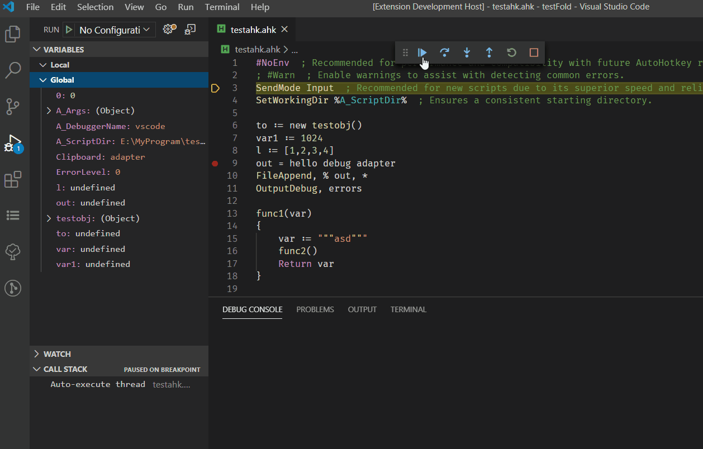

# AutoHotKey Debug

Simple debug adaptor for AutoHotKey implemented by AutoHotKey.

## Features

* Basic debug functions. Step into, step out, breakpoints etc.
* Show call stack and varibles.

## Using

1. Open an AutoHotKey source file.
2. Switch to the debug viewlet.
3. Press the green 'play' button to start debugging.

## Supported Settings of Launch.json

* `stopOnEntry`: stop on entry or not.
* `captureStreams`: capture io streams or not.

## Known Issues

An early version which needs test. Use it at you own risk.
1. Unsupport for non-ascii characters.
2. ~~Breakpoint may can't set or cancel~~ (solution: fixed)

## Release Notes

### 0.0.3

Fix display bug in object

### 0.0.5

Support redirecting standard io streams to debug console.

### 0.1.0

1. Fix bugs abort breakpoints.
2. Support viewing variables in different stacks.

### 0.1.1

1. Fix display bugs

## Furture Plan

* [ ] Support Evaluate For Hovers
* [x] Support debug console
* [ ] Change value of varible in debugging
